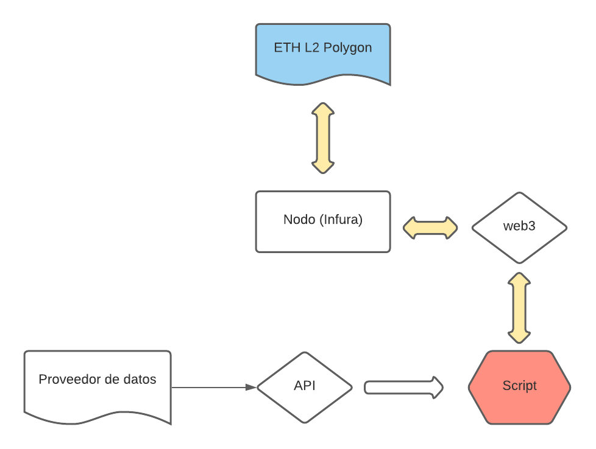

# Auto Yield Farmer & Yield Protecter (en fase de exploración)
## Descripción
Este proyecto intenta generar una especie de programa que se ejecute de manera automática y sea capaz de interactuar con los contratos inteligentes en función de valores o comportamientos que interesen.  
Por ejemplo, yield farming arriesgado con miedo de bajada de precios por parte de alguna whale que quiere comprar baratito, y que en caso de que baje X%, se salga automáticamente del contrato y pase todo a una stablecoin( o lo que se quiera )
## Esquema inicial
Lo que se quiere realizar de primeras es un pequeña script que usando la web3 y un servicio que ofrezca conexión a un nodo de ETH, puede realizar transacciones en el L2 de Polygon.  

  

Por lo que se necesita:
* [Web3](https://web3py.readthedocs.io/en/stable/quickstart.html#installation): para interactuar con el nodo
* [Nodo Infura](www.infura.io): para poder conectar al blockchain de ETH
* [Info económica](https://www.youtube.com/watch?v=dQw4w9WgXcQ): para saber los precios en tiempo real de los token que nos interesen  
* [Api de Livewathc](https://www.livecoinwatch.com/tools/api): opcion intersante, 100% gratis
* [Info de contratos red de Eth](https://etherscan.io/apis): acceso a la API para la red L1 de Etherum
* [Info de contratos red de Polygon](https://polygonscan.com/apis): acceso a la API para la red L2 de Polygon

La razón por la que vamos a necesitar acceso a esas dos APIs es debido a que necesitamos el [ABI](https://solidity-es.readthedocs.io/es/latest/abi-spec.html) del contrato inteligente
para poder interacturar con el mismo usando la web3.
## Cómo usar la biblioteca
Por ahora está en una fase muy inicial y puede que en el futuro tenga cambios (sobre todo la parta de autentificación de APIs). Para poder interactuar de primeras hay que crear un ```token.json``` dentro de src y añadir campos de esta manera:
```
"API_KEY_ETH" : "tu_llave",
"API_KEY_POLY": "tu_llave"
```
Añadido esto, puedes acceder al modulo de ```scan```. A continuación, pongo un ejemplo de uso:
```python
from src.scan import *
from src.utils import *


wallet = random_wallet_generator() # genero una cartera random (muy muy seguramente vacia(ojala no xD))
wallet_data = scan(wallet["public_addres"]) # objeto con la que podemos ver
print(wallet_data.get_eth_balance()) # cantidad de eth en la wallet
print(wallet_data.get_matic_balance()) # lo mismo en matic
print(wallet_data.get_poly_transactions()) # obtiene todas las transacciones de la cartea de la red Poly L2
print(wallet_data.get_eth_transactions()) # obtiene todas las transacciones de la cartera de la red ETH L1
```
## Tareas a hacer  

[Aqui](https://impartial-heaven-152.notion.site/b3c0e33c851f4a689ba5e205473d8bfa?v=cd07a0ca972c4f6dba22ad15a8b21409)
## Esquema futuro
Para futuro sería interesante alquilar un servidor en la nube y tenerlo funcionando de manera continua y poder interactuar con este
con un bot de telegram o app para el movil.
Aunque creo que la primera aplicación la haré directamente en el terminal.
## Recursos interesantes
¿ No tienes ni idea de cómo va Ethereum? Ntr bro, mirate este [libro](https://github.com/ethereumbook/ethereumbook)  

En caso de que no sepas leer, te recomiendo que inviertas en $TITAN (not financial advice)
